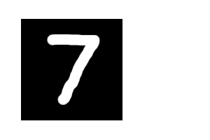

# Neural Network From Scratch In Python

This is a neural network made from scratch in python using numpy.

## Installation

Clone the repository

```bash
  > git clone https://github.com/Outdatedcandy92/NeuralNetwork.git
  > cd NeuralNetwork
```
Install requirements
```bash
  > pip install -r requirements.txt
```

    
## Usage

### Step 1: Training

1. Change `LEARNING_RATE` & `ITERATIONS` to your liking or leave it as is.   
`(Around 91% Accuracy on 1000 Iterations at 0.20 LR)`

```python
#Adjust these variables to your liking
LEARNING_RATE = 0.20 
ITERATIONS = 1000
```
2. Run train.py 
   
```bash
> python train.py
```

#### Output:
```python
Iteration:  480
Accuracy: 89.46%
Figure(640x480)
Iteration:  490
Accuracy: 90.17%
Figure(800x600)
```

### Step 2: Testing the model

1. Run draw.py

```bash
> python draw.py
```
2. Inside the pygame window draw a number and then press `S` to get the prediction.   

 


## How does it works?

#### 1. We have 28x28 pixel images



#### 2. Images are converted into a .csv
 For Simplicty we are just looking at an example with 1 number (with random values).

| Label   | 1x1 | 1x2 | 1x3 | ... | 28x28 |
| ------- | --- | --- | --- | --- | --- |
| 9       | 0   | 0   | 153   | ... | 343   |

 
- Here each pixel is given a value between `0` and `255` based on its brightness.
- `0` being black, `255` being complelty white

#### 3. We convert the csv into a matrix

[![\\ X = \begin{bmatrix}-- X^{[1]}-- \\. \\ .\\.\\--X^{[m]}--\end{bmatrix}^{T}  =  \begin{bmatrix} | ... | \\X^{[1]} ... X^{[m]} \\| ... | \\\end{bmatrix}   \\ ](https://latex.codecogs.com/svg.latex?%5C%5C%20X%20%3D%20%5Cbegin%7Bbmatrix%7D--%20X%5E%7B%5B1%5D%7D--%20%5C%5C.%20%5C%5C%20.%5C%5C.%5C%5C--X%5E%7B%5Bm%5D%7D--%5Cend%7Bbmatrix%7D%5E%7BT%7D%20%20%3D%20%20%5Cbegin%7Bbmatrix%7D%20%7C%20...%20%7C%20%5C%5CX%5E%7B%5B1%5D%7D%20..%20X%5E%7B%5Bm%5D%7D%20%5C%5C%7C%20...%20%7C%20%5C%5C%5Cend%7Bbmatrix%7D%20%20%20%5C%5C%20)](#_)
- Here in the first matrix, each row has 784 values, accounting for the value of each pixel
- We then transpose it and now each column has 784 values
- `m` = the number of examples our training data has

#### -> What we are aiming for


